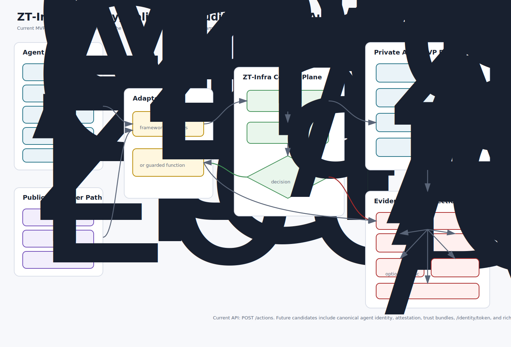
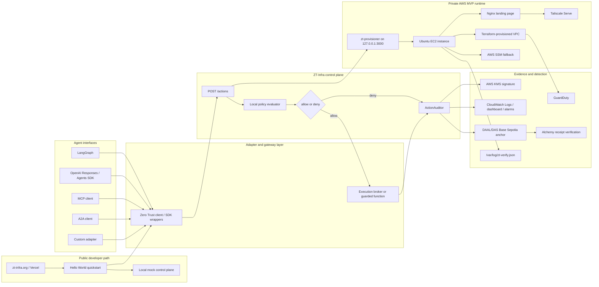

# ZT-Infra Architecture

This architecture diagram is the reviewed source diagram for current collateral. It started from the most complete existing presentation artifact, `docs/presentations/zt_first_customer_system_interop_package/05c_first_customer_architecture.drawio`, then was updated to match the current implementation state and narrowed positioning.

Use this file for websites, presentations, partner conversations, and internal architecture review. The SVG asset is available at [docs/assets/zt-infra-current-architecture.svg](./assets/zt-infra-current-architecture.svg).

## Current Architecture

## Mermaid Source

## What The Diagram Shows

- **Agent interfaces**: LangGraph, OpenAI Responses / Agents SDK, MCP, A2A, and custom adapters can normalize requests into one control-plane contract.
- **Public developer path**: `zt-infra.org` and `oscarmackjr-twg/zt-adapter-hello-world` provide the public quickstart, local mock, and adapter onboarding flow.
- **Adapter and gateway layer**: SDK wrappers and protocol gateways implement the portable agent action contract, call policy before execution, fail closed, and return a consistent audit envelope.
- **Control plane**: the current implemented endpoint is `POST /actions`; it evaluates local policy and returns `allow` or `deny`.
- **Execution containment**: Nono and future brokers enforce runtime constraints after policy allows execution. ZT-Infra does not replace those sandboxes.
- **Private AWS runtime**: Terraform provisions the private MVP runtime with no public ingress, Tailscale access, and SSM fallback.
- **Evidence and detection**: audit records are hash-chained, KMS-signed when configured, anchored asynchronously through DAAL/DAS when enabled, reconciled with Alchemy receipt verification, and observable through CloudWatch and verification logs.

## Current Versus Future

## Layer Boundaries

| Layer | Example primitives | ZT-Infra relationship |
| --- | --- | --- |
| Identity | SPIFFE/SPIRE, NANDA-style agent identity | Consume identity and bind it into `actor`. |
| Policy / governance | CSA ATF, OPA, Cedar | Wrap decisions in an agent-shaped contract. |
| Execution containment | nono, gVisor, Firecracker, Kata, browser sandboxes | Handoff approved work to a broker; record evidence. |
| Observability | SIEM, OpenTelemetry, eBPF/runtime telemetry | Emit consistent audit records. |

Current:

- `POST /actions`
- local policy evaluation
- signed audit record shape
- Nono and Docker broker examples
- CloudWatch audit sink
- DAAL/DAS implementation with a verified Base Sepolia CDP direct-mode smoke transaction
- Tailscale and SSM access
- public Hello World adapter site

Future:

- canonical transient agent identity
- workload-bound credentials
- signed agent/runtime attestation
- trust bundles and federation
- richer `/authorize` and `/identity/token` APIs
- conformance suite for external adapter authors
- production DAAL reconciliation, stuck-attestation alerts, and Base mainnet readiness runbook
